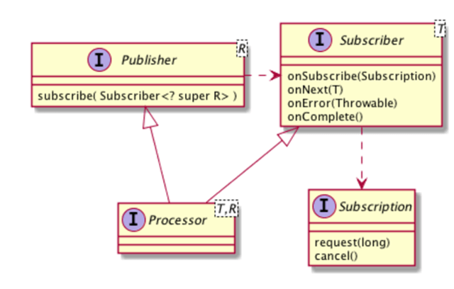

Data Service
=============

[Reactive Streams API](http://www.reactive-streams.org/) specification provides prescription for building modern, cloud scale architectures.
Reactive systems should be **responsive** in a timely manner, **resilient** in spite of failures, **elastic** adjusting under varying workload and (asynchronous) **message driven** ensuring loose coupling, isolation and location transparency.
In reactive streams failures are handled with callbacks. **Back pressure** is a key concept in reactive applications which empowers the client to specify the amount of records they can receive, preventing thread blocking in the call chain and to ensure producers don’t overwhelm consumers.
It supports Non-Blocking calls by working with limited a number of threads, thus conserving resources with less thread switching.
The Reactive Streams API consists of just 4 interfaces.

* **Publisher**: A Publisher is the producer the of data, according to the demand requested by its Subscribers.
* **Subscriber**: The consumer of the data produced by a Publisher.
* **Subscription**: A Subscription is the result of a Subscriber subscribing to a Publisher. It is the means that a Subscriber can utilize to request more data.
* **Processor**: It represents the processing stage—which is both a Subscriber and a Publisher and obeys the contracts of both.

When an instance of Subscriber is passed on to a Publisher, it will receive a call on its method, onSubscribe(Subscription), but it will not start receiving any events yet. Items will only be received by the Subscriber when it calls the method request(long) in its Subscription, signaling a demand for new items. The Subscriber can receive data through three distinct methods:

* Subscriber.onNext() is invoked with the next item and can be called n times, with n being the long value passed on the method request(long) of its Subscription.
* Subscriber.onError() is invoked when an error occurred while processing the stream. 
* Subscriber.onComplete() is invoked when there is no further data to be processed.

In the case of onError() and onComplete(), no new data will be emitted, even if the method request(long) is called again.

   

There are many implementations of Reactive Streams API available namely, RxJava, Reactor and Akka Streams.
[RxJava](https://github.com/ReactiveX/RxJava) is one of the Java implementation of the Reactive Streams API from the ReactiveX project.
[Reactor](https://projectreactor.io/) is a Reactive Streams compliant implementation from Pivotal and focuses on server-side Java, developed in close collaboration with Spring.
[Akka Streams](https://doc.akka.io/docs/akka/current/stream/index.html) although fully implements the [Reactive Streams specification](https://github.com/reactive-streams/reactive-streams-jvm/blob/v1.0.1/README.md#specification), the Akka Streams API is completely decoupled from the Reactive Streams interfaces.
Java 9 Reactive streams is part of the Java API and the interfaces are under [java.util.concurrent.Flow](https://docs.oracle.com/javase/9/docs/api/java/util/concurrent/Flow.html) class.

Spring uses [Reactor](https://projectreactor.io/) to further extend the basic Reactive Streams Publisher contract with the Flux and Mono composable API types.
[Spring WebFlux](https://docs.spring.io/spring/docs/current/spring-framework-reference/web-reactive.html) framework provides support for reactive programming in Spring 5, offering developers the ability to create servers and clients that support HTTP and WebSockets using a reactive stack.
WebFlux supports both Annotation-based with @Controller as well as Functional, Java 8 lambda style routing and handling also known as Router Functions.
WebFlux has two implementations of Publisher interface:

* **Mono**:It is a publisher which will produce only one value. It observes 0 or 1 item, with Mono<Void> hinting at most 0 items.
* **Flux**: It is a publisher that will produce multiple values, potentially unlimited values. It observes 0 to N items and eventually may or may not terminate successfully.

### Installation and Running of MongoDB

* Download latest [Windows MongoDB release](https://www.mongodb.org/dl/win32/x86_64-2008plus-ssl) and extract the zip file.
* Create directories **data** and **logs** in MONGODB_HOME directory, were MONGODB_HOME is the path to the unzipped mongodb directory.
* Create file **mongo.log** in MONGODB_HOME/logs directory.
* Create **mongod.cfg** file using [MongoDB configuration options](https://docs.mongodb.com/v3.2/reference/configuration-options/) in MONGODB_HOME/bin directory. Alternatively copy **mongod.cfg** file from spring-microservices/data-service/config and add to MONGODB_HOME/bin directory.
* Find & edit the token **@logs@** with path "MONGODB_HOME\logs" and **@data@** with path "MONGODB_HOME\data".
* Go to MONGODB_HOME\bin directory and execute the command "mongod --config mongod.cfg" to run mongodb.
* MongoDB runs on default port 27017.

All the above steps can be executed directly by running below runMongodb gradle task for windows.

    $ gradle runMongodb

### Running the Data Service

The **CONFIG_SERVICE_PASSWORD** is a required parameter to run data-service as it enables to access data-service.yml configuration file from the [config-service](../config-service/README.md).
Optionally **spring.profiles.active** can be passed with value **production** which enables logback to send all logs to [Elastic Stack](../elastic-stack/README.md) instead of logging in the console by default.

    $ java -jar data-service/build/libs/data-service-0.0.1-SNAPSHOT.jar
           -DCONFIG_SERVICE_PASSWORD=xxxx
		   -Dspring.profiles.active=production

### Notes

* [Install MongoDB Shell](Mongo_Shell.md) to view the collections and records within MongoDB database. 
* Data service uses [MapStruct](http://mapstruct.org/) for mapping between domain object to DTO object. MapStruct requires [mapstruct-processor](https://github.com/mapstruct/mapstruct) to be configured in gradle to generate the corresponding Mapper implementation for defined MapStruct interface. Hence it is highly recommended to **run gradle build before running data-service** to avoid Spring NoSuchBeanDefinitionException for MapStruct autowirings.     
